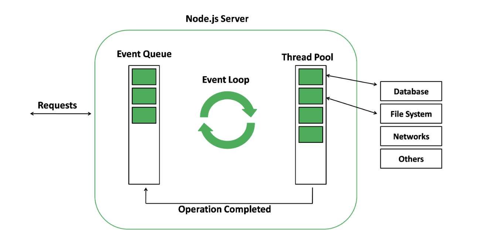

# Node and Express js questions

### 1. What is Node.js and what is it primarily used for?

**=>** Node.js is an open-source, server-side JavaScript runtime environment built on Chrome's V8 JavaScript engine. It allows developers to run JavaScript code on the server-side, enabling them to build scalable network applications.

Node.js is primarily used for building fast, scalable network applications due to its event-driven, non-blocking I/O model. It's commonly used for building web servers, APIs, real-time chat applications, streaming applications, and more. With its package ecosystem, npm (Node Package Manager), developers have access to a vast array of libraries and tools to streamline development processes.

### 2. How does Node.js handle asynchronous operations and why is it different from traditional multi-threaded handling?

**=>** Node.js handles asynchronous operations using an event-driven, non-blocking I/O model. This means that instead of waiting for operations like file I/O or network requests to complete before moving on to the next task, Node.js executes asynchronous operations concurrently and processes their results through callback functions or promises.

The main difference between Node.js's asynchronous model and traditional multi-threaded handling lies in how they manage resources and concurrency:

1. Event-driven, non-blocking I/O model: Node.js uses a single-threaded event loop to manage asynchronous operations. When an asynchronous operation is initiated, Node.js does not block the execution of subsequent code. Instead, it continues processing other tasks and registers callback functions to be executed once the asynchronous operation completes. This allows Node.js to handle a large number of concurrent connections efficiently without requiring a thread per connection.
2. Traditional multi-threaded handling: In traditional multi-threaded environments, such as those found in languages like Java or C++, each connection or task typically corresponds to a separate thread. Creating and managing threads can be resource-intensive, especially for applications with a high number of concurrent connections. Additionally, synchronization mechanisms like locks and semaphores are often needed to prevent race conditions and ensure thread safety.

Overall, Node.js's asynchronous, event-driven model provides scalability and high concurrency without the overhead of managing multiple threads, making it well-suited for building fast and scalable network applications.

### 3. What is the Event Loop in Node.js and why is it important?

**=>** The Event Loop is a crucial component of the Node.js runtime environment. It's responsible for handling asynchronous operations and non-blocking I/O in Node.js applications. Here's why it's important:

1. **Asynchronous Nature**: Node.js is designed to be non-blocking, meaning it doesn't wait for I/O operations to complete before moving on to the next task. Instead, it delegates I/O operations to the system kernel and continues executing other tasks in the meantime. The Event Loop manages the execution of these asynchronous operations, ensuring that callbacks are triggered when operations complete.
2. **Efficiency**: By using a single-threaded event loop, Node.js avoids the overhead associated with traditional multi-threaded models, such as context switching and thread management. This makes Node.js applications more efficient and scalable, especially for I/O-bound tasks where waiting for I/O operations would otherwise waste CPU cycles.
3. **Concurrency**: The Event Loop allows Node.js to handle multiple concurrent connections efficiently. It can process I/O operations from different clients concurrently without blocking the execution of other tasks. This concurrency is essential for building high-performance web servers and real-time applications.
4. **Event-Driven Programming**: Node.js applications are built around event-driven programming paradigms. Events are emitted when certain conditions are met (e.g., a file is read, a request is received), and corresponding event handlers (callbacks) are executed in response. The Event Loop plays a central role in managing these events and event handlers, ensuring that they are executed in the correct order.

Overall, the Event Loop is a fundamental concept in Node.js that enables its asynchronous, non-blocking behavior, making it well-suited for building highly scalable and performant applications. Understanding how the Event Loop works is essential for writing efficient Node.js code and designing robust applications.

### 4. Explain the differences between **require()** and ES6 **import** in Node.js.

**=>** Certainly! Here are the main differences between `require()` and ES6 `import` in Node.js:

1. **Syntax**:

   - `require()`: Uses CommonJS syntax, where modules are imported using `require()` function.
   - `import`: Uses ES6 syntax, where modules are imported using `import` statement.
2. **Default vs. Named Exports**:

   - `require()`: Supports importing both default and named exports from modules.
   - `import`: Supports importing default and named exports separately using different syntax:
     - Default import: `import module from 'module';`
     - Named import: `import { namedExport } from 'module';`
3. **Static vs. Dynamic Import**:

   - `require()`: Supports only synchronous loading of modules, meaning all required modules are loaded at the beginning of the program execution.
   - `import`: Supports both synchronous (static) and asynchronous (dynamic) loading of modules.
     - Static import: `import module from 'module';` (loaded at compile time)
     - Dynamic import: `import('module').then(module => {/* ... */});` (loaded at runtime)
4. **Compatibility**:

   - `require()`: Works with both CommonJS and AMD modules. It's the traditional way of importing modules in Node.js.
   - `import`: Works with ECMAScript modules (ESM) and is part of the ES6 specification. It's the modern way of importing modules in JavaScript, but it's not fully supported in Node.js without experimental flags.
5. **Module Resolution**:

   - `require()`: Resolves modules relative to the current file's directory and supports additional configuration through `require.resolve()`.
   - `import`: Resolves modules according to ECMAScript module resolution rules, which include looking for modules in `node_modules` directories and supporting the `package.json` "module" field for specifying entry points.
6. **Property Assignment**:

   - `require()`: Assigns imported module exports directly to variables or properties.
   - `import`: Does not support assigning imported module exports directly to properties. Instead, you need to assign them to variables first.

Overall, while `require()` is the traditional way of importing modules in Node.js and is still widely used, `import` provides a more modern syntax and additional features, especially for ES6 modules. However, full adoption of `import` in Node.js requires support for ECMAScript modules, which is still evolving.

### 5. What is **process.nextTick()**? How does it differ from **setImmediate()**?

**=>** `process.nextTick()` and `setImmediate()` are both mechanisms for executing code asynchronously in Node.js, but they have different behaviors and priorities in the event loop:

1. **`process.nextTick()`**:
   - `process.nextTick()` queues a function to be executed in the next iteration of the event loop, immediately after the current operation completes.
   - Functions queued with `process.nextTick()` are executed before any other I/O events or timers.
   - It's often used to defer the execution of a callback until after the current synchronous code has finished, allowing the callback to run before I/O events or timers are processed.
   - Since `process.nextTick()` callbacks are executed before I/O events, they can cause "starvation" if overused, leading to other I/O operations being delayed.

Example:

```javascript
console.log('Start');
process.nextTick(() => console.log('Next Tick'));
console.log('End');
```

Output:

```
Start
End
Next Tick
```

2. **`setImmediate()`**:
   - `setImmediate()` queues a function to be executed in the next iteration of the event loop, but after any I/O events that are already in the event queue.
   - It's designed to execute callback functions asynchronously, but with lower priority compared to I/O operations.
   - Functions queued with `setImmediate()` are typically executed after the current I/O events and timers, allowing I/O operations to be processed first before executing the callback.
   - It's commonly used to schedule code to run after I/O events, timers, or other asynchronous operations.

Example:

```javascript
console.log('Start');
setImmediate(() => console.log('Set Immediate'));
console.log('End');
```

Output:

```
Start
End
Set Immediate
```

In summary, `process.nextTick()` executes callbacks before I/O events, while `setImmediate()` executes callbacks after I/O events. The choice between them depends on the specific use case and desired behavior in the event loop.

### 6. How do you manage and use environment variables in a Node.js application?

**=>** Managing and using environment variables in a Node.js application is essential for configuring and deploying applications across different environments (development, staging, production, etc.) without hardcoding sensitive information. Here's how you can manage and use environment variables in a Node.js application:

1. **Creating Environment Variables**:

   - Environment variables are typically set outside the application code, either directly in the shell or using a configuration file.
   - In Unix/Linux, you can set environment variables in the terminal:
     ```bash
     export MY_VARIABLE=value
     ```
   - In Windows, you can set environment variables in the command prompt:
     ```bash
     set MY_VARIABLE=value
     ```
   - Alternatively, you can use a `.env` file to define environment variables and use a package like `dotenv` to load them into your Node.js application.
2. **Accessing Environment Variables in Node.js**:

   - Node.js provides access to environment variables through the `process.env` object.
   - To access an environment variable in your Node.js code:
     ```javascript
     const myVariable = process.env.MY_VARIABLE;
     ```
   - You can then use `myVariable` within your application code.
3. **Using Environment Variables**:

   - Environment variables are commonly used for configuration, such as database connection strings, API keys, port numbers, etc.
   - For example, you might have a database connection string stored in an environment variable:
     ```javascript
     const mongoose = require('mongoose');
     mongoose.connect(process.env.DB_CONNECTION_STRING);
     ```
   - This allows you to change configuration settings without modifying the code.
4. **Managing Environment Variables in Different Environments**:

   - It's common to have different environment variables for different environments (e.g., development, staging, production).
   - You can set environment variables differently for each environment to customize the application's behavior.
   - For example, you might have different database connection strings or API keys for development and production environments.
5. **Using `dotenv` Package (Optional)**:

   - The `dotenv` package allows you to load environment variables from a `.env` file into `process.env`.
   - Install `dotenv` using npm or yarn:

     ```bash
     npm install dotenv
     ```

     or
     ```bash
     yarn add dotenv
     ```
   - Create a `.env` file in the root directory of your project and define your environment variables:

     ```plaintext
     MY_VARIABLE=value
     ```
   - Load the environment variables in your Node.js application:

     ```javascript
     require('dotenv').config();
     ```

By managing environment variables properly, you can improve the security and flexibility of your Node.js applications and ensure they work seamlessly across different environments.

### 7. What are the main differences between **Buffer** and **Array** in Node.js?

**=>** In Node.js, both `Buffer` and `Array` are used for handling data, but they have different characteristics and purposes. Here are the main differences between `Buffer` and `Array`:

1. **Purpose**:

   - **Buffer**: The `Buffer` class is specifically designed for handling binary data, such as reading from or writing to streams, file operations, network communications, cryptography, and other scenarios where raw binary data is manipulated.
   - **Array**: The `Array` class, on the other hand, is used to store a collection of elements of any type, typically for organizing and manipulating data in a structured manner.
2. **Underlying Storage**:

   - **Buffer**: Internally, a `Buffer` is implemented as a fixed-size chunk of memory allocated outside the JavaScript heap. It is a raw representation of binary data and is particularly efficient for handling binary operations.
   - **Array**: An `Array` is a dynamic data structure that can grow or shrink in size as elements are added or removed. It is implemented as a JavaScript object and uses dynamic memory allocation on the heap.
3. **Data Representation**:

   - **Buffer**: Binary data in a `Buffer` is stored as a sequence of bytes, where each byte represents a single numeric value ranging from 0 to 255. It provides methods for reading from or writing to specific byte positions within the buffer.
   - **Array**: Elements in an `Array` can be of any JavaScript data type, such as numbers, strings, objects, or even other arrays. It provides methods for manipulating arrays, such as `push`, `pop`, `splice`, `concat`, etc.
4. **Typical Use Cases**:

   - **Buffer**: Used in scenarios requiring low-level binary data manipulation, such as file I/O, network communication, cryptography, and working with binary protocols like TCP/IP or HTTP.
   - **Array**: Used for storing and manipulating collections of data in a higher-level, more abstract manner, such as managing lists of items, performing operations like sorting or filtering, and representing structured data.
5. **Encoding and Decoding**:

   - **Buffer**: Provides methods for encoding and decoding binary data into different character encodings, such as UTF-8, ASCII, Base64, etc.
   - **Array**: Does not have built-in encoding or decoding functionality, as it is primarily used for handling structured data rather than raw binary data.

In summary, `Buffer` is specialized for handling binary data in a low-level, efficient manner, while `Array` is a general-purpose data structure for storing and manipulating collections of data in JavaScript.

### 8. Explain the purpose and usage of the **npm** command in the Node.js ecosystem.

**=>** The `npm` command is a package manager for Node.js that allows developers to easily install, manage, and share JavaScript packages and dependencies. It stands for "Node Package Manager." Here's an overview of its purpose and usage:

1. **Package Installation**:

   - `npm install <package-name>`: Installs a package from the npm registry. If a specific version is not specified, npm installs the latest version by default.
   - `npm install`: Installs all dependencies listed in the `package.json` file of the current project.
2. **Package Management**:

   - `npm update <package-name>`: Updates a package to its latest version.
   - `npm uninstall <package-name>`: Uninstalls a package from the local project.
   - `npm ls`: Lists installed packages and their dependencies.
   - `npm outdated`: Lists packages that are outdated, along with their current and latest versions.
3. **Project Initialization**:

   - `npm init`: Initializes a new Node.js project and creates a `package.json` file interactively, allowing developers to specify project details and dependencies.
   - `npm init -y` or `npm init --yes`: Initializes a new project with default settings without prompting for input.
4. **Dependency Management**:

   - `npm install <package-name> --save`: Installs a package and adds it to the `dependencies` section of the `package.json` file.
   - `npm install <package-name> --save-dev`: Installs a package and adds it to the `devDependencies` section of the `package.json` file, typically used for development-only dependencies.
   - `npm ci`: Installs dependencies from the `package-lock.json` file, ensuring deterministic and consistent dependency resolution for production environments.
5. **Scripts**:

   - `npm run <script-name>`: Executes a script defined in the `scripts` section of the `package.json` file. Common scripts include `start`, `test`, `build`, `lint`, etc.
6. **Publishing Packages**:

   - `npm publish`: Publishes the current package to the npm registry, making it available for others to install and use.
7. **Authentication and Configuration**:

   - `npm login`: Logs in to an npm account.
   - `npm logout`: Logs out from the current npm account.
   - `npm config set <key> <value>`: Sets configuration options for npm, such as registry URL, proxy settings, etc.
   - `npm config get <key>`: Retrieves the value of a specific configuration option.

Overall, `npm` simplifies the process of managing dependencies, initializing projects, executing scripts, and publishing packages in the Node.js ecosystem, making it an essential tool for Node.js developers.

### 9. How can you prevent callback hell in Node.js?

**=>** Callback hell, also known as "pyramid of doom," occurs when multiple asynchronous operations are nested within each other, leading to deeply nested and hard-to-read code. To prevent callback hell in Node.js, you can use several approaches:

1. **Use Promises**:

   - Promises provide a cleaner way to handle asynchronous operations and avoid callback nesting. You can chain promises using `.then()` and handle errors with `.catch()`.

   ```javascript
   someAsyncFunction()
     .then(result => {
       return anotherAsyncFunction(result);
     })
     .then(anotherResult => {
       // Handle another result
     })
     .catch(error => {
       // Handle errors
     });
   ```
2. **Async/Await**:

   - Async/await is a modern JavaScript feature that allows writing asynchronous code in a synchronous style. It provides a more readable and maintainable alternative to promises.

   ```javascript
   async function someFunction() {
     try {
       const result = await someAsyncFunction();
       const anotherResult = await anotherAsyncFunction(result);
       // Handle another result
     } catch (error) {
       // Handle errors
     }
   }
   ```
3. **Modularization**:

   - Break down complex logic into smaller, manageable functions. This helps reduce the nesting of callbacks and makes the code more modular and reusable.
4. **Use Control Flow Libraries**:

   - Control flow libraries like Async.js provide functions such as `async.waterfall`, `async.series`, and `async.parallel` to organize asynchronous code without deep nesting.

   ```javascript
   async.waterfall([
     function(callback) {
       // Async operation 1
       callback(null, result1);
     },
     function(result1, callback) {
       // Async operation 2
       callback(null, result2);
     },
     function(result2, callback) {
       // Async operation 3
       callback(null, finalResult);
     }
   ], function(err, finalResult) {
     if (err) {
       // Handle error
     } else {
       // Handle final result
     }
   });
   ```
5. **Use ES6 Arrow Functions**:

   - Arrow functions help reduce visual clutter by providing a concise syntax for defining functions, which can make the code cleaner and easier to read.

   ```javascript
   someAsyncFunction((err, result) => {
     if (err) {
       // Handle error
     } else {
       anotherAsyncFunction(result, (err, anotherResult) => {
         if (err) {
           // Handle error
         } else {
           // Handle another result
         }
       });
     }
   });
   ```

By applying these techniques, you can effectively prevent callback hell and write more maintainable and readable asynchronous code in Node.js.

### 10. How would you handle errors in a Node.js callback-based function?

**=>** In a Node.js callback-based function, error handling is crucial to ensure robustness and reliability. Here's how you can handle errors effectively:

1. **Check for Error in Callback**:

   - Always check for an error object in the callback function. If the error object is present, handle the error appropriately.

   ```javascript
   someAsyncFunction((err, result) => {
     if (err) {
       // Handle error
       console.error('Error:', err);
     } else {
       // Proceed with the result
       console.log('Result:', result);
     }
   });
   ```
2. **Throwing Errors**:

   - You can throw errors within the callback function if they are critical and need to be handled at a higher level.

   ```javascript
   someAsyncFunction((err, result) => {
     if (err) {
       throw new Error('An error occurred: ' + err.message);
     }
     // Proceed with the result
   });
   ```
3. **Passing Errors to Callback**:

   - When writing your own callback-based functions, ensure that errors are passed as the first argument to the callback.

   ```javascript
   function myAsyncFunction(callback) {
     if (/* some condition */) {
       callback(new Error('An error occurred'));
     } else {
       callback(null, 'Success');
     }
   }

   myAsyncFunction((err, result) => {
     if (err) {
       console.error('Error:', err);
     } else {
       console.log('Result:', result);
     }
   });
   ```
4. **Error Event Emitters**:

   - Some Node.js modules or classes emit error events. You can listen for these events to handle errors.

   ```javascript
   const fs = require('fs');

   const stream = fs.createReadStream('file.txt');

   stream.on('error', (err) => {
     console.error('Error reading file:', err);
   });
   ```
5. **Global Error Handling**:

   - You can use the `process.on('uncaughtException')` event to catch unhandled exceptions globally. However, it's generally better to handle errors at the appropriate level of your application.

   ```javascript
   process.on('uncaughtException', (err) => {
     console.error('Unhandled Exception:', err);
     // Perform cleanup and exit process if necessary
     process.exit(1);
   });
   ```

By following these practices, you can effectively handle errors in Node.js callback-based functions and ensure the reliability of your applications.

### 11. What is Express.js and how does it relate to Node.js?

**=>** Express.js is a web application framework for Node.js, designed to build web applications and APIs more easily by providing a set of robust features and utilities. It sits on top of Node.js, leveraging its capabilities for server-side logic and networking.

Here's how Express.js relates to Node.js:

1. **Framework for Node.js**: Express.js is built with Node.js and utilizes its capabilities to create web servers and handle HTTP requests and responses. It provides an abstraction layer over Node.js's core HTTP module, simplifying the process of building web applications.
2. **Routing**: Express.js simplifies routing by providing a routing mechanism to handle different HTTP methods (GET, POST, PUT, DELETE, etc.) and URL paths. This makes it easier to define the behavior of the application based on the incoming requests.
3. **Middleware**: One of the key features of Express.js is its middleware system. Middleware functions can be chained together to perform various tasks such as logging, authentication, data parsing, error handling, etc. This modular approach enhances code organization and reusability.
4. **Template Engines**: Express.js supports various template engines (like EJS, Pug, Handlebars) to generate dynamic HTML content on the server side. These template engines integrate seamlessly with Express.js, allowing developers to create views for their web applications.
5. **Static File Serving**: Express.js simplifies the serving of static files (like CSS, JavaScript, images) by providing built-in middleware functions for this purpose. This allows developers to serve static content directly from the filesystem without writing custom code.
6. **Extensibility**: Express.js is highly extensible, allowing developers to add custom middleware, plugins, or third-party modules to enhance the functionality of their applications. This flexibility enables developers to tailor Express.js to their specific needs.

In summary, Express.js is a web application framework that complements Node.js by providing a higher level of abstraction and a suite of features to simplify the process of building web applications and APIs on top of Node.js's core capabilities.

### 12. Describe middleware in the context of Express.js. Give an example.

**=>** Middleware in Express.js refers to functions that have access to the request (req) and response (res) objects in the application's request-response cycle. Middleware functions can perform tasks such as modifying request or response objects, executing additional code, or terminating the request-response cycle. Middleware functions can be used to implement various functionalities such as authentication, logging, error handling, and request preprocessing.

Middleware functions in Express.js are executed sequentially in the order they are defined. Each middleware function in the chain can optionally call the next middleware function to pass control to the next handler in the stack.

Here's an example of how middleware is used in Express.js:

```javascript
const express = require('express');
const app = express();

// Middleware function to log requests
const loggerMiddleware = (req, res, next) => {
    console.log(`[${new Date().toISOString()}] ${req.method} ${req.url}`);
    next(); // Pass control to the next middleware function
};

// Middleware function to authenticate users
const authenticateMiddleware = (req, res, next) => {
    // Check if user is authenticated
    if (req.isAuthenticated()) {
        // User is authenticated, proceed to the next middleware
        next();
    } else {
        // User is not authenticated, send a 401 Unauthorized response
        res.status(401).send('Unauthorized');
    }
};

// Middleware function to parse JSON bodies
app.use(express.json());

// Use the loggerMiddleware for all requests
app.use(loggerMiddleware);

// Use the authenticateMiddleware for protected routes
app.get('/protected', authenticateMiddleware, (req, res) => {
    res.send('You are authenticated');
});

// Error-handling middleware
app.use((err, req, res, next) => {
    console.error(err.stack);
    res.status(500).send('Internal Server Error');
});

// Start the server
const PORT = 3000;
app.listen(PORT, () => {
    console.log(`Server is running on http://localhost:${PORT}`);
});
```

In this example:

- `loggerMiddleware` logs details of incoming requests.
- `authenticateMiddleware` checks if the user is authenticated before allowing access to a protected route.
- Middleware functions are added to the Express app using the `app.use()` method.
- Middleware functions can optionally call the `next()` function to pass control to the next middleware function.
- Error-handling middleware is used to handle errors that occur during request processing.

### 13. How do you handle CORS (Cross-Origin Resource Sharing) in an Express.js application?

**=>** In an Express.js application, you can handle CORS (Cross-Origin Resource Sharing) by using the `cors` middleware. The `cors` middleware allows you to define which origins are allowed to access your resources, what HTTP methods are supported, and which headers can be exposed or accepted.

Here's how you can handle CORS in an Express.js application:

1. Install the `cors` middleware package:

```bash
npm install cors
```

2. Use the `cors` middleware in your Express.js application:

```javascript
const express = require('express');
const cors = require('cors');

const app = express();

// Allow all origins to access the resources (not recommended for production)
app.use(cors());

// Alternatively, you can specify specific origins
// app.use(cors({ origin: 'http://example.com' }));

// Example route
app.get('/', (req, res) => {
  res.send('Hello World!');
});

// Start the server
const PORT = process.env.PORT || 3000;
app.listen(PORT, () => {
  console.log(`Server is running on http://localhost:${PORT}`);
});
```

In this example:

- We import the `cors` middleware package.
- We use the `cors()` function to enable CORS for all routes. By default, this allows requests from any origin (`*`). This is not recommended for production environments due to security reasons.
- Alternatively, you can specify specific origins by passing an options object to the `cors()` function. For example, `{ origin: 'http://example.com' }` allows requests only from `http://example.com`.
- The `app.use(cors())` middleware is applied globally to all routes, allowing CORS for all requests.

By using the `cors` middleware, you can control cross-origin requests in your Express.js application, ensuring security and compatibility with modern web standards.

### 14. Explain the difference between **app.get()** and **router.get()** in Express.js.

**=>** In Express.js, both `app.get()` and `router.get()` are used to define routes for handling HTTP GET requests, but they serve different purposes:

1. **app.get()**:

   - `app.get()` is a method of the Express application object (`app`). It is used to define routes for handling HTTP GET requests at the application level.
   - Routes defined using `app.get()` are accessible throughout the entire application.
   - It is typically used for defining routes that are common across different parts of the application.
   - Example:

   ```javascript
   const express = require('express');
   const app = express();

   app.get('/', (req, res) => {
     res.send('Hello World!');
   });
   ```
2. **router.get()**:

   - `router.get()` is a method of the Express Router object (`router`). It is used to define routes for handling HTTP GET requests at the router level.
   - Routes defined using `router.get()` are scoped to the specific router instance and can be mounted to a specific path in the application.
   - It is typically used for organizing routes into modular and reusable components.
   - Example:

   ```javascript
   const express = require('express');
   const router = express.Router();

   router.get('/', (req, res) => {
     res.send('Hello World!');
   });
   ```

In summary, `app.get()` is used to define routes at the application level, while `router.get()` is used to define routes at the router level. Depending on the complexity and structure of your application, you may choose to use one or both of these methods to define routes.

### 15. How would you serve static files (like CSS, JS, or images) using Express.js?

**=>** To serve static files such as CSS, JS, or images using Express.js, you can use the built-in `express.static` middleware. This middleware function is based on the `serve-static` package and allows you to serve static files from a directory.

Here's how you can serve static files using Express.js:

1. Create a directory to store your static files (e.g., `public`).
2. Place your static files (CSS, JS, images, etc.) inside the `public` directory.
3. In your Express application file (e.g., `app.js`), use the `express.static` middleware to serve the static files:

   ```javascript
   const express = require('express');
   const app = express();

   // Serve static files from the 'public' directory
   app.use(express.static('public'));

   // Define your routes and other middleware
   // ...

   // Start the Express server
   app.listen(3000, () => {
     console.log('Server is running on port 3000');
   });
   ```
4. Access your static files using their relative paths from the `public` directory. For example, if you have a file named `styles.css` inside the `public/css` directory, you can access it in your HTML file like this:

   ```html
   <link rel="stylesheet" href="/css/styles.css">
   ```

   This will serve the `styles.css` file located in the `public/css` directory when the browser requests the `/css/styles.css` route.

By following these steps, Express will automatically serve any files located within the `public` directory. This approach makes it easy to manage and serve static assets in your Express.js applications.

### 16. Describe the process of parsing incoming request bodies in Express.js, including how to handle different content types.

**=>** In Express.js, parsing incoming request bodies is essential for extracting data sent by clients via HTTP requests. The process involves middleware functions provided by Express to parse request bodies in different formats such as JSON, URL-encoded, and multipart form data. Here's how you can handle different content types in Express.js:

1. **JSON Data:**
   To parse JSON data sent in the request body, you can use the built-in `express.json()` middleware. This middleware parses incoming JSON payloads and makes the parsed data available in `req.body`.

   ```javascript
   const express = require('express');
   const app = express();

   // Middleware to parse JSON bodies
   app.use(express.json());

   // Example route to handle POST requests
   app.post('/api/users', (req, res) => {
     console.log(req.body); // Access parsed JSON data
     res.send('User data received');
   });

   // Start the Express server
   app.listen(3000, () => {
     console.log('Server is running on port 3000');
   });
   ```
2. **URL-encoded Data:**
   For parsing URL-encoded data (e.g., form submissions), you can use the `express.urlencoded()` middleware. This middleware parses incoming requests with URL-encoded payloads and makes the parsed data available in `req.body`.

   ```javascript
   const express = require('express');
   const app = express();

   // Middleware to parse URL-encoded bodies
   app.use(express.urlencoded({ extended: true }));

   // Example route to handle form submissions
   app.post('/api/login', (req, res) => {
     console.log(req.body); // Access parsed URL-encoded data
     res.send('Login successful');
   });

   // Start the Express server
   app.listen(3000, () => {
     console.log('Server is running on port 3000');
   });
   ```
3. **Multipart Form Data:**
   For handling multipart form data (e.g., file uploads), you can use the `multer` middleware. `Multer` is a Node.js middleware for handling multipart/form-data, which is primarily used for uploading files. You need to install `multer` separately using npm.

   ```bash
   npm install multer
   ```

   Here's an example of using `multer` to handle file uploads:

   ```javascript
   const express = require('express');
   const multer = require('multer');
   const app = express();

   // Middleware to handle file uploads
   const upload = multer({ dest: 'uploads/' });

   // Example route to handle file uploads
   app.post('/api/upload', upload.single('file'), (req, res) => {
     console.log(req.file); // Access uploaded file
     res.send('File uploaded successfully');
   });

   // Start the Express server
   app.listen(3000, () => {
     console.log('Server is running on port 3000');
   });
   ```

In summary, Express.js provides middleware functions like `express.json()`, `express.urlencoded()`, and packages like `multer` to parse incoming request bodies in different formats. Depending on the content type of the request, you can use the appropriate middleware to parse the request body and access the data sent by the client.

### 17. How can you handle authentication in an Express.js application?

**=>** Handling authentication in an Express.js application involves verifying the identity of users before granting access to protected resources or routes. Here's a general approach to implement authentication:

1. **User Model:** Define a user model to store user information such as username, email, password hash, etc. You can use a database like MongoDB with Mongoose ORM or SQL databases like PostgreSQL with Sequelize ORM.
2. **Registration:** Implement a route for user registration where users can create an account by providing necessary information like username, email, and password. Upon registration, hash the password using a secure hashing algorithm like bcrypt before storing it in the database.
3. **Login:** Create a route for user login where users can authenticate themselves by providing their credentials (e.g., email/username and password). Verify the provided credentials against the stored credentials in the database. If they match, generate a token (JWT or session) and send it to the client for subsequent requests.
4. **Token-based Authentication:** Use tokens (JWT or session) for authentication. When users successfully login, issue a token containing user information (e.g., user ID) signed with a secret key. Send this token to the client and ask the client to include it in subsequent requests as an Authorization header or in a cookie.
5. **Middleware:** Create middleware functions to protect routes that require authentication. These middleware functions should verify the token sent by the client, extract user information from it, and attach it to the request object (e.g., `req.user`). Routes protected by this middleware will only be accessible to authenticated users.
6. **Logout:** Implement a route for user logout where users can invalidate their tokens. This can be done by removing the token from the client-side (e.g., deleting the token from local storage or cookies) or by maintaining a blacklist of revoked tokens on the server.

Here's a simplified example of how you can implement authentication in an Express.js application using JWT:

```javascript
const express = require('express');
const jwt = require('jsonwebtoken');
const bcrypt = require('bcrypt');
const User = require('./models/User');

const app = express();

// Middleware to parse JSON bodies
app.use(express.json());

// Authentication route (Login)
app.post('/login', async (req, res) => {
  const { email, password } = req.body;

  // Find user by email
  const user = await User.findOne({ email });

  if (!user) {
    return res.status(401).json({ message: 'Invalid email or password' });
  }

  // Verify password
  const isPasswordValid = await bcrypt.compare(password, user.password);

  if (!isPasswordValid) {
    return res.status(401).json({ message: 'Invalid email or password' });
  }

  // Generate JWT token
  const token = jwt.sign({ userId: user._id }, 'secret_key', { expiresIn: '1h' });

  res.json({ token });
});

// Protected route
app.get('/profile', authenticateToken, (req, res) => {
  // Access user information from req.user
  res.json({ user: req.user });
});

// Middleware to authenticate token
function authenticateToken(req, res, next) {
  const token = req.headers.authorization;

  if (!token) {
    return res.status(401).json({ message: 'Access denied. Token missing' });
  }

  jwt.verify(token, 'secret_key', (err, user) => {
    if (err) {
      return res.status(403).json({ message: 'Invalid token' });
    }

    req.user = user;
    next();
  });
}

app.listen(3000, () => {
  console.log('Server is running on port 3000');
});
```

In this example, the `/login` route handles user authentication by verifying the email and password against the stored credentials. If the credentials are valid, a JWT token is generated and sent to the client. The `/profile` route is protected by the `authenticateToken` middleware, which verifies the JWT token sent by the client before granting access to the route.

### 18. Explain the purpose and usage of template engines in Express.js, giving examples.

**=>** Template engines in Express.js serve the purpose of dynamically rendering HTML content by combining static templates with dynamic data. They allow developers to create reusable views/templates that can be populated with data from the server before being sent to the client's browser. Some popular template engines used with Express.js include EJS, Pug (formerly Jade), Handlebars, and Mustache.

Here's a brief explanation of how template engines are used in Express.js:

1. **Installation:** First, you need to install the desired template engine package using npm. For example, to install EJS, you would run `npm install ejs`.
2. **Setup:** After installation, you need to configure Express.js to use the template engine. This involves setting the `view engine` and `views` directory in your Express application.

   ```javascript
   const express = require('express');
   const app = express();

   // Set EJS as the template engine
   app.set('view engine', 'ejs');

   // Set the directory for views/templates
   app.set('views', './views');

   // Other middleware and routes...
   ```
3. **Rendering Views:** With the template engine configured, you can now render views/templates in your routes using the `res.render()` method. You pass the name of the template (without the file extension) and an object containing the data to be injected into the template.

   ```javascript
   // Example using EJS template engine
   app.get('/profile', (req, res) => {
     const userData = { name: 'John Doe', email: 'john@example.com' };
     res.render('profile', { user: userData });
   });
   ```
4. **Creating Templates:** Templates are created using the syntax specific to the chosen template engine. Here's a simple example using EJS:

   ```ejs
   <!-- views/profile.ejs -->
   <html>
   <head>
     <title>User Profile</title>
   </head>
   <body>
     <h1>Welcome, <%= user.name %>!</h1>
     <p>Email: <%= user.email %></p>
   </body>
   </html>
   ```
5. **Dynamic Data:** In the template, you can embed dynamic data using special tags or syntax provided by the template engine. In the case of EJS, `<%= %>` is used to output the value of a JavaScript expression.

   In the example above, `<%= user.name %>` and `<%= user.email %>` will be replaced with the corresponding values from the `userData` object passed to `res.render()`.
6. **Rendering Partial Views:** Template engines also support the concept of partial views or reusable components. These can be included within other views to promote code reusability.

   ```ejs
   <!-- views/header.ejs -->
   <header>
     <h1>My Website</h1>
     <nav>
       <ul>
         <li><a href="/">Home</a></li>
         <li><a href="/about">About</a></li>
         <!-- Other navigation items... -->
       </ul>
     </nav>
   </header>

   <!-- views/profile.ejs -->
   <html>
   <head>
     <title>User Profile</title>
   </head>
   <body>
     <% include header %>
     <h1>Welcome, <%= user.name %>!</h1>
     <p>Email: <%= user.email %></p>
   </body>
   </html>
   ```

In summary, template engines allow for the dynamic generation of HTML content by combining static templates with dynamic data. They simplify the process of creating and rendering views in Express.js applications, promoting code reusability and maintainability.

### 19. How can you set up route parameters and retrieve them in an Express.js route handler?

**=>** In Express.js, route parameters are placeholders in the route pattern that capture values specified in the URL. These parameters are then available in the route handler function through the `req.params` object. Here's how you can set up route parameters and retrieve them:

1. **Setting Up Route Parameters:**

   - Route parameters are specified in the route URL using colon `:` followed by the parameter name.
   - For example, to define a route with a parameter for user IDs, you would use `/users/:userId`.
2. **Retrieving Route Parameters:**

   - In the route handler function, you can access the route parameters through the `req.params` object.
   - The keys of `req.params` correspond to the parameter names specified in the route URL.
   - For example, if the route URL is `/users/:userId`, you can access the `userId` parameter using `req.params.userId`.

Here's an example demonstrating how to set up route parameters and retrieve them in an Express.js route handler:

```javascript
const express = require('express');
const app = express();

// Route handler for /users/:userId
app.get('/users/:userId', (req, res) => {
  // Retrieve the userId parameter from req.params
  const userId = req.params.userId;

  // Use the userId parameter in the route handler logic
  // For demonstration, just send back the user ID as the response
  res.send(`User ID: ${userId}`);
});

// Start the Express server
const PORT = 3000;
app.listen(PORT, () => {
  console.log(`Server is running on http://localhost:${PORT}`);
});
```

In this example, when a GET request is made to `/users/123`, the route handler retrieves the value `123` from the `userId` parameter and sends it back as the response.

### 20. Describe the significance and usage of the **app.use()** function in Express.js.

**=>** In Express.js, the `app.use()` function is a crucial part of middleware handling. It is used to mount middleware functions at a specified path or to the application's root path if no path is specified. Here's a breakdown of its significance and usage:

1. **Mounting Middleware Functions:**

   - The `app.use()` function is primarily used to mount middleware functions in the Express application's middleware stack.
   - Middleware functions are functions that have access to the request object (`req`), the response object (`res`), and the next middleware function in the application's request-response cycle.
   - Middleware functions can perform tasks such as logging, error handling, parsing request bodies, authenticating users, and more.
2. **Mounting Middleware at a Path:**

   - When the `app.use()` function is called with a path argument, the middleware function is only invoked for requests whose path matches the specified path.
   - This allows for selective application of middleware based on the request path.
   - For example, `app.use('/api', apiMiddleware)` will only invoke `apiMiddleware` for requests to paths starting with `/api`.
3. **Mounting Middleware at the Root Path:**

   - If the `app.use()` function is called without a path argument, the middleware function is invoked for every incoming request to the Express application.
   - This is useful for applying middleware that should run for every request, such as logging middleware or middleware for setting up CORS headers.

Here's an example demonstrating the usage of `app.use()` to mount middleware functions:

```javascript
const express = require('express');
const app = express();

// Middleware function for logging
const loggerMiddleware = (req, res, next) => {
  console.log(`[${new Date().toISOString()}] ${req.method} ${req.url}`);
  next(); // Call next to pass control to the next middleware function
};

// Middleware function for handling JSON bodies
app.use(express.json());

// Mounting loggerMiddleware at the root path
app.use(loggerMiddleware);

// Route handler for GET requests to /
app.get('/', (req, res) => {
  res.send('Hello World!');
});

// Start the Express server
const PORT = 3000;
app.listen(PORT, () => {
  console.log(`Server is running on http://localhost:${PORT}`);
});
```

In this example:

- `express.json()` middleware is used to parse JSON bodies in incoming requests.
- `loggerMiddleware` is mounted at the root path using `app.use()` to log information about each incoming request.
- The route handler for GET requests to `/` sends back a simple "Hello World!" response.
